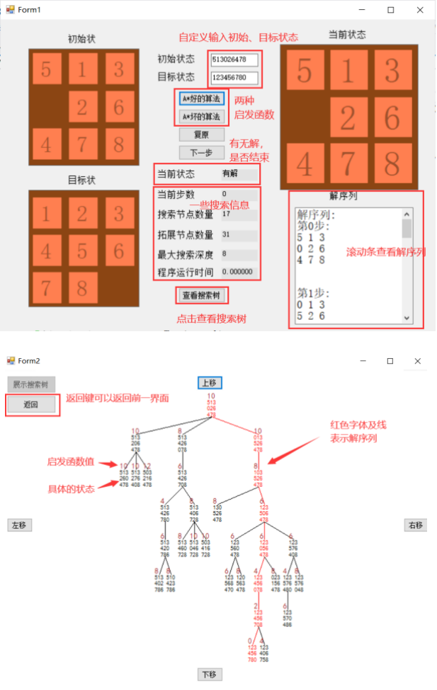

## A*算法求解八数码问题，并使用c#可视化

- 8 数码问题是 A\*算法的一大重要应用，而对于 A\*搜索算法来说，算法的好坏与启发函 数的评价标准设定有着直接的关系。同时为了优化算法，在算法执行的过程中构建了键值对和值键对的双 map，避免了需要遍历所有元素查找所消耗的时间。 

- 本实验的具体实现分为 A\*搜索树生成的内核部分与搜索树的绘制展示部分。内核部分使用 C++语言编写，主要是借助了 c++强大的 STL 容器；展示部分则使用 C#语言编写，利用其控件属性，很好的解决洁面问题。通过 dll 文件实现在 c#使用 c++函数，用以总体实现A\*搜索树的生成与绘制。

****

